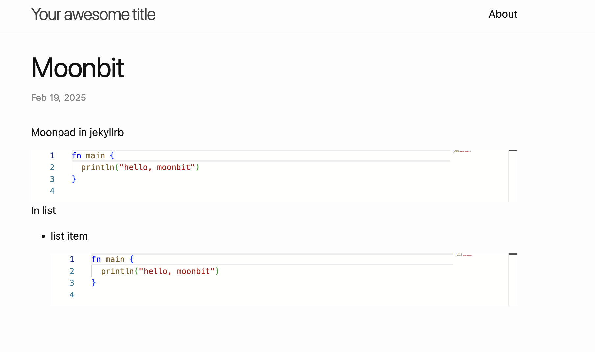

# Moonpad jekyll Example

This is the jekyll example described in the Moonpad blog

## Get started

First, install jekyll following the instructions in the [jekyll website](https://jekyllrb.com/).

Then, run the following commands to build the site and bundle the javascript.

```bash
npm i
jekyll build
node ./esbuild.js
```

start a local server to see the site.

```bash
python3 -m http.server 8081 -d _site/
```

open http://localhost:8081/moonbit/2025/02/19/moonbit.html and you can see the moonbit codeblock is rendered in moonpad.


