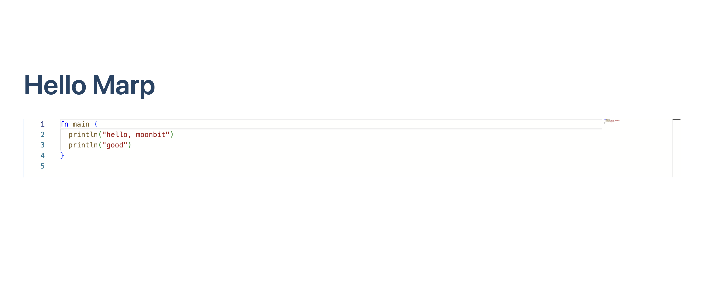

# Moonpad marp Example

This is the marp example described in the Moonpad blog

## Get started

run the following commands to bundle the javascript and start the marp server.

```bash
npm install
node ./esbuild.js
marp --html --server slide/
```

open http://localhost:8080/moonbit.md and you can see the moonbit codeblock is rendered in moonpad.


